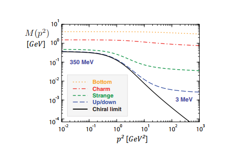

# Quark_propagator
Solution of the quark Dyson-Schwinger equation (DSE) done as a project at ECT* Doctoral Training Program, May 2–18, 2022, Hadron Physics with Functional Methods. Among the tasks, we found the quark mass $M(p^2)$ for different flavours (see Fig. below). For further detail, see the PDF file in the repo.

